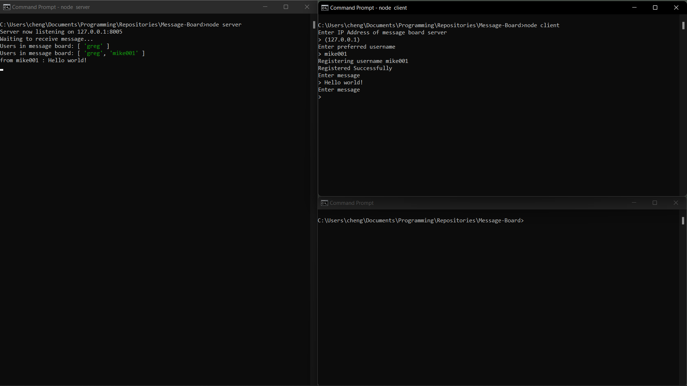
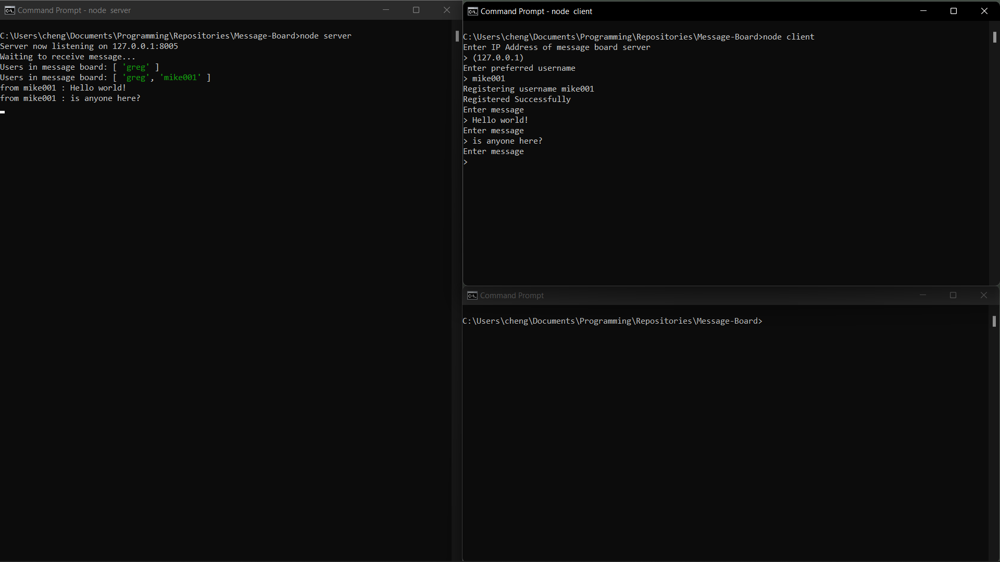
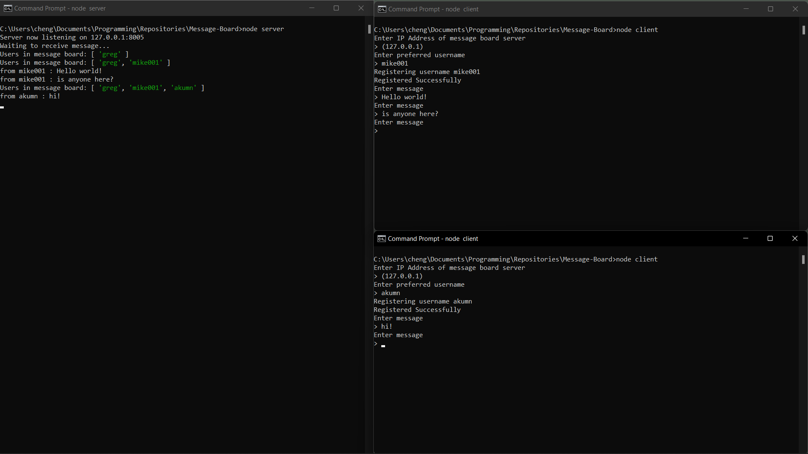
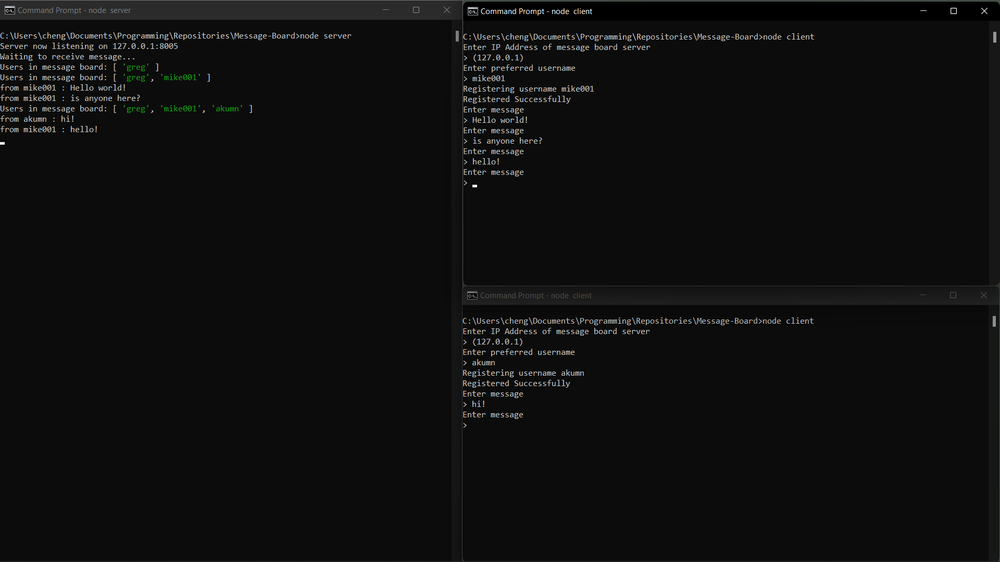
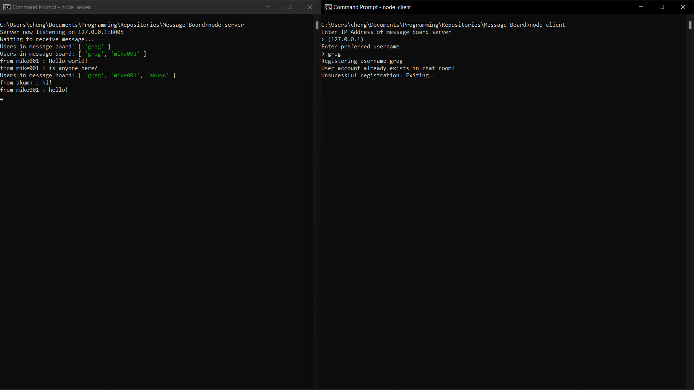

# Message-Board
Project for CSNETWK

## TODOs
- [X] User Registration
- [ ] User Deregistration
- [X] Post messages to server
- [ ] (**optional**) Server to not accept empty messages and returns an appropriate response
- [ ] Client 'bye' message not being displayed on server

## Modules
- `datagram` - For **UDP** connections. [api](https://www.npmjs.com/package/datagram)[documentation](https://nodejs.org/api/dgram.html).
- `udp-json` - Sending and receiving JSON. [api](https://www.npmjs.com/package/udp-json).
- `readline` - **Client Only**. Used to read inputs from the console. [documentation](https://nodejs.org/api/readline.html).

## Project Folders
- [`client`](client) 
- [`server`](server)

## Sample Program images
**User 1** registers and sends messages:

**User 2** registers and sends messages:

**Both** users start chatting:

**Both** users leave the room:

Example of a user with an unsucessful registration:

